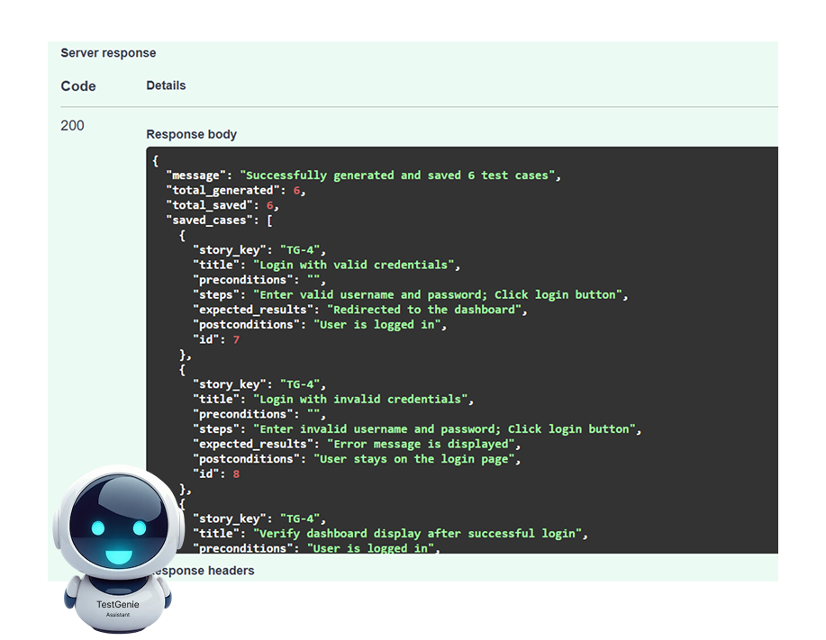
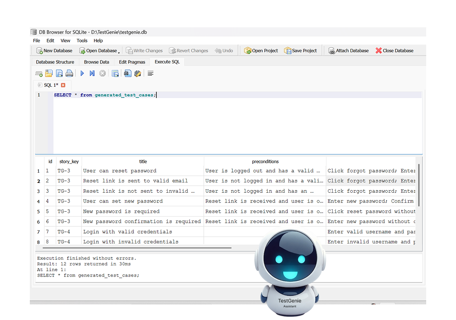

# TestGenie

TestGenie is a FastAPI-based backend application designed to manage, store, and automate test cases. It uses SQLAlchemy for database interactions and Pydantic for request validation.

TestGenie helps QA engineers generate, manage, and integrate test cases from user stories and change requests.  
It provides seamless integration with Jira and GitHub Actions for CI/CD automation.


---
# 
# 
## Table of Contents

- [Introduction](#testgenie)
- [Project Roadmap](#project-roadmap)
- [Features](#features)
- [Tech Stack](#tech-stack)
- [Project Structure](#project-structure)
- [Installation](#installation)
- [Usage](#usage)
- [Contributing](#contributing)
- [License](#license)

---

## Project Roadmap

### 🚀 TestGenie Project Roadmap

#### 📅 Phase 1 – Basic Functionality (Completed)
- ✅ Initialize FastAPI project with Pydantic and SQLAlchemy.
- ✅ Set up Alembic for database migrations.
- ✅ Integrate with Jira API.
- ✅ Implement CRUD endpoints for test case management.
- ✅ Create user story (e.g., TG-1).
- ✅ Configure AIO Tests for test case management.
- ✅ Create manual test cases for TG-1 in AIO Tests.

#### 📅 Phase 2 – Test Case Generation (In Progress)
- ✅ Develop logic for test case generation based on user story text.
- ✅ Implement saving generated test cases to database.
- 🔄 Implement integration with Jira to create test cases automatically.
- 🔄 Build text processing modules (e.g., LLM-based or rule-based approaches).
- 🔄 Test correctness and accuracy of generated test cases.

#### 📅 Phase 3 – Functionality Expansion
- 📌 Add endpoints for exporting test cases to various formats (CSV, PDF).
- 📌 Implement user roles and access control.
- 📌 Visualize user story coverage with diagrams or dashboards.

#### 📅 Phase 4 – Deployment and Documentation
- 📌 Set up CI/CD pipelines.
- 📌 Deploy the application (e.g., Heroku, AWS).
- 📌 Prepare comprehensive documentation, including data flow diagrams.

#### 📅 Phase 5 – MVP Development for Demo
- 📌 Integrate all functionality into a cohesive MVP.
- 📌 Test and debug the application.
- 📌 Prepare for the MVP demo presentation.

---

## Features

- Create, update, and list test cases.
- SQLite/PostgreSQL support.
- Ready for CI/CD and Docker deployment.
- Seamless integration with Jira for user story management.

---

## Tech Stack

- **FastAPI**: Backend framework.
- **SQLAlchemy**: ORM for database interactions.
- **Pydantic**: Data validation and settings management.
- **Pytest**: Unit testing framework.

---

## Project Structure

```
TestGenie/
├── app/                 # Main application code
│   ├── __init__.py      # Initialize app
│   ├── config.py        #
│   ├── crud.py          # CRUD operations
│   ├── database.py      # 
│   ├── jira_service.py  #
│   ├── main.py          # FastAPI app initialization  
│   ├── models.py        # Database models (SQLAlchemy)
│   ├── schemas.py       # Pydantic models for request validation
├── migrations/          # Database migrations (Alembic)
├── tests/               # Unit tests for the application
│   ├── logs/            # Unit test reports
│   ├── __init__.py      # initialize tests
│   ├── test_crud.py     # crud unit tests 
│   ├── test_database.py # database unit tests
│   ├── test_main.py     # main unit tests
│   ├── test_models.py   # models unit tests
│   ├── test_schemas.py  # schemas unit tests
├── .gitignore           # Files and directories to ignore in Git
├── init_structure.sh    # Initialize project structure
├── LICENSE              # Project license
├── README.md            # Project documentation
├── requirements.txt     # Python dependencies
└── venv/                # Virtual environment (not committed)
```

## Installation

1. Clone the repository:
   ```bash
   git clone https://github.com/enchloreas/TestGenie.git
   cd TestGenie
   ```

2. Create and activate a virtual environment:
   ```bash
   python -m venv venv
   .\venv\Scripts\Activate.ps1  # On Windows
   ```

3. Install dependencies:
   ```bash
   pip install -r requirements.txt
   ```

4. Set up the database:
   ```bash
   The database tables will be created automatically when you first run the application. No manual migration or Alembic command is required.
   ```

5. Run the application:
   ```bash
   uvicorn app.main:app --reload
   ```

6. Access the API documentation at `http://127.0.0.1:8000/docs`.

## Usage

- To create test cases, use the `/testcases` endpoint.
- Integrate with Jira by configuring your `.env` file with Jira credentials.
- Automate CI/CD pipelines using the provided GitHub Actions workflows.

## Contributing

We welcome contributions! Please follow these steps:

1. Fork the repository.
2. Create a new branch for your feature or bugfix:
   ```bash
   git checkout -b feature-name
   ```
3. Commit your changes and push to your fork.
4. Submit a pull request.

## License

This project is licensed under the MIT License. See the [LICENSE](LICENSE) file for details.